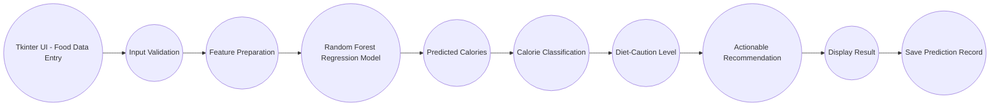

# Food-Calories-Prediction-System

#### 1. Problem Statement:

- The calorie content of packed and home-cooked food is rarely obvious to consumers.
- People tracking their diet may find it difficult to estimate calories from nutrition labels at a glance.
- A data-driven system can help predict the calories of a food serving from its nutritional composition.
- The system can provide dietary cautions and recommendations for healthier eating.
- Manual calorie estimation from protein, carbohydrate and fat values is time-consuming and error-prone.


#### 2. Proposed Solution: 
- Collect food-related nutritional information. 
- Validate the entered data. 
- Process the input features required by the Machine Learning model. 
- Use a Random Forest Regression model to predict calories per serving.
- Classify foods based on the predicted calorie value.
- Determine the diet-caution level.
- Generate actionable dietary recommendations using nutritional indicators.
- Display the results through a user-friendly Tkinter interface. 
- Support batch prediction using CSV files.
- Store every user entry and its prediction in a CSV file and a separate Excel file (food_prediction.xlsx).

#### 3. Process Flow:

<p align="center">
  Start
  <br>
  &darr;
  <br>
  Enter Student Details
  <br>
  &darr;
  <br>
  Validate Input
  <br>
  &darr;
  <br>
  Prepare Input Features
  <br>
  &darr;
  <br>
  ML Prediction
  <br>
  &darr;
  <br>
  Determine Performance Level
  <br>
  &darr;
  <br>
  Determine Risk Level
  <br>
  &darr;
  <br>
  Generate Actionable Recommendation
  <br>
  &darr;
  <br>
  Display Result
  <br>
  &darr;
  <br>
  Save Prediction Record
  <br>
  &darr;
  <br>
  End
</p>

#### 4. Project Mapping:

| V-Model Stage           | Smart Student Project                                      |
|:------------------------|:-----------------------------------------------------------|
| Requirement Analysis    | Identify student performance prediction requirements       |
| System Design           | Design ML workflow, application architecture and GUI       |
| Implementation          | Develop Python + ML + Tkinter application                  |
| Integration             | Integrate GUI, trained model and recommendation logic      |
| Testing                 | Test input validation, prediction and batch processing     |
| Validation              | Evaluate model using R², RMSE, MAE and cross-validation    |
| Demonstration           | Present working student performance prediction application |

### 5. Requirement Analysis
#### 5.1 Functional Requirements
The system should:
+ Accept food details.
+ Accept nutritional indicators (per 100 g).
+ Validate user inputs.
+ Validate nutrient and serving-size ranges.
+ Process input data.
+ Load the trained ML model.
+ Predict calories per serving.
+ Classify foods based on predicted calories.
+ Determine the diet-caution level.
+ Generate actionable dietary recommendations.
+ Display results through the GUI.
+ Handle invalid inputs.
+ Provide a clear/reset option.
+ Provide an exit option.
+ Support batch CSV prediction.
+ Store prediction results (CSV master log + separate XLSX workbook).

#### 5.2 Non Functional Requirements:
The application should be:
+ User-friendly
+ Easy to understand
+ Fast in generating predictions
+ Reliable
+ Maintainable
+ Scalable
+ Robust against invalid inputs
+ Secure with respect to user dietary data
+ Easy to test
+ Suitable for academic demonstration

#### 5.3 Identify the Users
Primary Users may include:
  + Diet-conscious individuals
  + Nutritionists and dietitians
  + Fitness trainers and gym members
  + Health / wellness application developers

#### 5.4 User Requirements
The user should be able to:
+ Enter food and nutrition information.
+ Submit the information for analysis.
+ View the predicted calories for the serving.
+ Understand the food's calorie classification.
+ Understand the diet-caution level.
+ Receive actionable dietary recommendations.
+ Clear the entered information.
+ Process multiple food records using a CSV file.


#### 5.5 Identify System Inputs
The system uses:
+ Food Name
+ Serving Size (g)
+ Protein (g per 100 g)
+ Carbohydrates (g per 100 g)
+ Total Fat (g per 100 g)
+ Dietary Fiber (g per 100 g)
+ Sugars (g per 100 g)

The six nutritional indicators used by the Machine Learning model are:
+ Serving Size (g)
+ Protein (g per 100 g)
+ Carbohydrates (g per 100 g)
+ Total Fat (g per 100 g)
+ Dietary Fiber (g per 100 g)
+ Sugars (g per 100 g)

Food Name is used for identification and record keeping and is not used as an ML feature. Every saved record also gets an automatic Timestamp.

| Parameter | Example |
|:----------|:--------|
| Serving Size | 150 g |
| Protein | 28 g/100 g |
| Carbohydrates | 0 g/100 g |
| Total Fat | 3.6 g/100 g |
| Dietary Fiber | 0 g/100 g |
| Sugars | 0 g/100 g |

#### 5.6 Identify System Outputs
###### 5.6.1 Calorie Prediction
  + Predicted Calories (kcal per serving)
  + Low Calorie
  + Moderate Calorie
  + High Calorie

###### 5.6.2 Additional Outputs
  + Diet-caution level
  + Actionable dietary recommendation
  + Prediction record
  + Batch prediction results

###### Example
__Prediction:__ Moderate Calorie \
__Predicted Calories:__ 197.58 kcal \
__Caution:__ Medium Caution \
__Recommendation:__ Fits into a balanced diet; keep portions consistent with your daily calorie goal.

#### 6. Project Modular Application Development
Create separate modules/functions for:
```text
validate_inputs()
predict_single()
predict_batch_csv()
clear_fields()
classify_food()
generate_recommendation()
load_dataset()
train()
append_to_master_csv()
append_to_master_xlsx()
```

The main responsibilities are divided among:
```text
main.py          -> full Tkinter app: validation, prediction, batch CSV, storage
functions.py     -> Day 1 console prototype (rule-based Atwater estimate)
fci.py           -> classification + recommendation logic (food intelligence)
train_model.py   -> dataset creation, cleaning, training, evaluation, saving
app.py           -> simple Tkinter prototype GUI (rule-based fallback; also logs every entry to CSV + XLSX)
api.py           -> FastAPI prediction service (/health, /predict)
test_operations.py -> Day 4 testing: executes the Test Operation Table
```

#### 7. From Requirements to System Design
##### __7.1 Input__
+ Food Name
+ Serving Size (g)
+ Protein (g per 100 g)
+ Carbohydrates (g per 100 g)
+ Total Fat (g per 100 g)
+ Dietary Fiber (g per 100 g)
+ Sugars (g per 100 g)

##### __7.2 Processing__
+ Validate input
+ Prepare ML features
+ Load trained Random Forest model
+ Predict calories per serving
+ Limit predicted calories to the 0–2000 kcal range
+ Determine calorie classification
+ Determine diet-caution level
+ Generate actionable recommendation
+ Store prediction result (CSV + XLSX)

##### __7.3 Output__
+ Predicted calories (kcal)
+ Calorie category
+ Diet-caution level
+ Actionable recommendation
+ Saved prediction record (CSV + XLSX)

#### 8. Proposed System Architecture


#### 9. UI Design Requirements
The application must contain:

> __9.1. Food Information Section__
   + Food Name

> **9.2. Nutritional Information Section** (per 100 g)
  + Serving Size
  + Protein
  + Carbohydrates
  + Total Fat
  + Dietary Fiber
  + Sugars

> **9.3. Action Section**
  + Predict Calories
  + Batch Predict CSV
  + Clear
  + Exit

> **9.4. Result Section**
  + Predicted Calories
  + Calorie Class
  + Diet-Caution Level
  + Recommendation

##### 10. Using Frames
```text
Main Window
├── Header
├── Food Details Frame
├── Nutritional Metrics Frame
├── Action / Button Frame
└── Prediction & Recommendations Frame
```

##### 11. Workflow
<p align="center"><br> User Enters Food Details <br> &darr; <br> User Clicks Predict Calories <br> &darr; <br> Button Generates Event <br> &darr; <br> Callback Function Executes <br> &darr; <br> Input Validation Starts <br> &darr; <br> Python + ML Processing Starts <br> &darr; <br> Result Is Displayed and Saved <br></p>

#### 12. Traditional Programming vs ML Programming

| Traditional Programming       | ML Programming                              |
|:------------------------------|:--------------------------------------------|
| Rules are written manually    | Model learns relationships from data        |
| Output = Logic + Input        | Output = Model + Input                      |
| Fixed logic (Atwater formula) | Learned calorie patterns                    |
| Rule changes require coding   | Model can be retrained with updated data    |

##### 13. ML Workflow
<p align="center"><br> Data Collection <br> &darr; <br> Data Loading <br> &darr; <br> Data Cleaning & Validation <br> &darr; <br> Feature Selection <br> &darr; <br> Train-Test Split <br> &darr; <br> Random Forest Model Training <br> &darr; <br> Model Evaluation <br> &darr; <br> Cross-Validation <br> &darr; <br> Model Saving <br> &darr; <br> Prediction <br></p>

**Dataset Creation**
+ Use the supplied food nutrition CSV dataset.
+ Dataset contains approximately 1,000 food records spanning 12 categories (Vegetables, Fruits, Dairy, Grains & Cereals, Meat & Poultry, Seafood, Legumes, Nuts & Seeds, Snacks, Beverages, Desserts, Fast Food).
+ The dataset includes food name, category, six nutritional features and the calorie target (ground truth derived from Atwater conversion factors with small real-world noise).

__Data Loading__
+ Load dataset using Pandas.
+ Check required columns.
+ Select the six ML feature columns and target column.
+ Display the number of valid records.

__Data cleaning__
+ Replace infinite values.
+ Remove missing values.
+ Convert required columns to numeric values.
+ Validate nutrient ranges (0–100 g per 100 g; fiber 0–40 g).
+ Validate serving-size range (1–1000 g).
+ Validate target calorie range (0–2000 kcal).

__Feature Selection__
+ Serving Size (g)
+ Protein (g)
+ Carbohydrates (g)
+ Total Fat (g)
+ Dietary Fiber (g)
+ Sugars (g)

__Target Variable__
+ Calories (kcal per serving)

__Model Training__
+ Train a Random Forest Regression model.
+ Use an 80/20 train-test split.
+ Use 300 decision trees.
+ Use controlled tree depth and minimum leaf size.
+ Use random_state = 42 for reproducibility.

__Model Evaluation__
+ Calculate R² score.
+ Calculate Root Mean Squared Error (RMSE).
+ Calculate Mean Absolute Error (MAE).
+ Perform 5-Fold Cross-Validation.
+ Analyze feature importance.

__Prediction__
+ Load the saved Random Forest model.
+ Accept new food input.
+ Predict calories per serving.
+ Keep the displayed prediction within 0–2000 kcal.
+ Determine classification and diet-caution level.
+ Generate an actionable recommendation.

__Save Model__
+ Save the trained model using Joblib.
+ Store the model as `calorie_model.pkl`.

__Prediction Storage__
+ Store individual and batch prediction records in `food_prediction.csv`.
+ Mirror every user entry and its prediction into the separate Excel workbook `food_prediction.xlsx` (sheet "Food Predictions") using OpenPyXL.

#### 14. Problem Type
**For this Project:**

+ **Regression Problem** \
The primary Machine Learning task is regression.

Output:
  + Calories per serving (kcal, 0–2000)

The Random Forest Regression model predicts a continuous calorie value.

+ **Classification / Diet-Caution Categorization** \
The predicted calories are converted into understandable calorie categories:

  + Low Calorie
  + Moderate Calorie
  + High Calorie

Caution levels are:

  + Low Caution
  + Medium Caution
  + High Caution

The classification and caution level are generated after the regression prediction; the trained ML model itself is a regression model.

#### 15. Model selection
**Algorithm Used for model training**

+ Random Forest Regressor

The model configuration includes:
+ `n_estimators = 300`
+ `max_depth = 10`
+ `min_samples_leaf = 2`
+ `random_state = 42`
+ `n_jobs = -1`

**Model Evaluation**

+ R² Score
+ RMSE
+ MAE
+ 5-Fold Cross-Validation
+ Feature Importance

**Why Random Forest?**

+ Handles non-linear relationships (e.g. serving-size × nutrient interactions).
+ Works well with structured/tabular nutrition data.
+ Can capture interactions between nutritional features.
+ Does not require feature scaling for this dataset.
+ Provides feature importance.
+ Offers a strong baseline for calorie prediction.

**Model Performance**

| Metric | Value |
|:-------|:------|
| Train / Test records | 800 / 200 |
| Hold-out R² | 0.9611 |
| Hold-out RMSE | 31.80 kcal |
| Hold-out MAE | 21.99 kcal |
| 5-Fold CV R² | 0.9604 (± 0.0044) |
| 5-Fold CV MAE | 23.91 kcal (± 1.09) |

**Feature Importance**

| Feature | Importance |
|:--------|:-----------|
| Serving Size (g) | 0.4342 |
| Total Fat (g) | 0.3132 |
| Carbohydrates (g) | 0.2023 |
| Protein (g) | 0.0312 |
| Sugars (g) | 0.0114 |
| Dietary Fiber (g) | 0.0078 |

#### 16. Improving the model
+ Increase the dataset size.
+ Use real labelled nutrition data (e.g. USDA FoodData Central / IFCT).
+ Perform hyperparameter tuning.
+ Compare Random Forest with Linear Regression, Decision Tree Regression and Gradient Boosting.
+ Perform additional feature selection.
+ Add explainable ML techniques.
+ Add feature-importance visualizations.
+ Add more nutrients (sodium, saturated fat, vitamins).
+ Add per-meal and per-day calorie tracking.
+ Add database storage.
+ Add user authentication and diet-goal profiles.
+ Improve batch prediction reporting.
+ Add graphical dashboards.
+ Validate the model on an independent real-world dataset.

---

### 17. Testing — Test Operation Table
The following table documents the test operations executed during the
**Integration + Testing** stage of the V-Model. Every operation is
implemented in `test_operations.py` and was executed against the trained
`calorie_model.pkl`.

| Test ID | Module / Function | Test Operation | Expected Result | Actual Result | Status |
|:--------|:------------------|:---------------|:----------------|:--------------|:------:|
| TO-01 | train_model.py / calorie_model.pkl | Load trained model file with joblib | Model loads without error | Model loaded successfully |  Pass |
| TO-02 | food_calorie_dataset_1000.csv | Check dataset record count and required columns | 1,000 records with all feature + target columns | 1,000 records, all required columns present |  Pass |
| TO-03 | main.validate_inputs() | Validate a complete, in-range record | Returns parsed data, no error | Record accepted, no error |  Pass |
| TO-04 | main.validate_inputs() | Submit form with an empty mandatory field | Validation error raised | Error: Please fill in all input fields. | Pass |
| TO-05 | main.validate_inputs() | Enter non-numeric value in a nutrient field | "must be a numerical value" error | Error: 'Protein (g)' must be a numerical value. |  Pass |
| TO-06 | main.validate_inputs() | Enter out-of-range nutrient value (fat = 150 g/100 g) | Range error raised | Error: 'Total Fat (g)' must fall between 0 and 100. |  Pass |
| TO-07 | main.validate_inputs() | Enter invalid serving size (0 g) | Range error raised | Error: 'Serving Size (g)' must fall between 1 and 1000. |  Pass |
| TO-08 | main.predict_single() + model | Predict calories for grilled chicken (150 g) | Prediction within ±1 RMSE (32 kcal) of Atwater estimate (~216.6 kcal) | 197.58 kcal (Atwater 216.6 kcal, diff 19.0 kcal) |  Pass |
| TO-09 | fci.classify_food() | Classify 120 kcal serving | "Low Calorie" / "Low Caution" | ('Low Calorie', 'Low Caution') |  Pass |
| TO-10 | fci.classify_food() | Classify 250 kcal serving | "Moderate Calorie" / "Medium Caution" | ('Moderate Calorie', 'Medium Caution') |  Pass |
| TO-11 | fci.classify_food() | Classify 480 kcal serving | "High Calorie" / "High Caution" | ('High Calorie', 'High Caution') |  Pass |
| TO-12 | fci.generate_recommendation() | Recommendation for high-fat, high-sugar dessert | Priority actions mentioning portion/fat and sugar | Priority actions: smaller portion/low-fat method; limit sugar; fiber-rich pairing; lean-protein pairing |  Pass |
| TO-13 | fci.generate_recommendation() | Recommendation for a low-caution food (apple) | Positive "enjoy freely / fits diet" message | Enjoy freely; fits well into most balanced, calorie-conscious diets. |  Pass |
| TO-14 | main.predict_batch_csv() | Batch-predict sample_batch_input.csv (7 foods) | 7 records predicted with output columns | 7 records processed and appended |  Pass |
| TO-15 | main.append_to_master_csv() | Verify batch results appended to food_prediction.csv | Row count grows by 7, columns match record schema | food_prediction.csv has 7 rows with correct columns |  Pass |
| TO-16 | functions.py (rule-based prototype) | Atwater estimate for 200 g serving (135 kcal/100 g food) | Exactly 270.0 kcal → Moderate Calorie | 270.00 kcal → Moderate Calorie |  Pass |
| TO-17 | api.py (FastAPI) | Call /health and /predict endpoints | Health OK and valid prediction JSON returned | /health model_loaded=True; /predict → 197.58 kcal (Moderate Calorie) |  Pass |
| TO-18 | main.append_to_master_xlsx() | Store user entry in the separate food_prediction.xlsx | Workbook created with header; rows appended on each entry | Workbook sheet 'Food Predictions': 1 header + 2 record rows appended |  Pass |

**Result: 18/18 test operations passed.**

---

#### 18. Project Structure
```text
FoodCaloriePredictionSystem/
├── README.md                        <- this file
├── main.py                          <- full Tkinter app (validation, single + batch prediction, CSV + XLSX storage)
├── app.py                           <- simple Tkinter prototype GUI (logs entries to CSV + XLSX too)
├── functions.py                     <- Day 1 console prototype (rule-based)
├── fci.py                           <- calorie classification + recommendation logic
├── train_model.py                   <- dataset creation, cleaning, training, evaluation, saving
├── api.py                           <- FastAPI prediction service
├── test_operations.py               <- executes the Test Operation Table
├── requirements.txt                 <- Python dependencies
├── food_calorie_dataset_1000.csv    <- 1,000-record training dataset
├── calorie_model.pkl                <- trained Random Forest model (joblib)
├── sample_batch_input.csv           <- example batch input (7 foods)
├── food_prediction.csv              <- stored prediction records (CSV log)
└── food_prediction.xlsx             <- stored prediction records (Excel log)
```

#### 19. API Example
```bash
curl -X POST http://127.0.0.1:8000/predict \
  -H "Content-Type: application/json" \
  -d '{"food_name": "Grilled Chicken",
       "serving_size": 150, "protein": 28, "carbohydrates": 0,
       "total_fat": 3.6, "dietary_fiber": 0, "sugars": 0}'
```
```json
{
  "food_name": "Grilled Chicken",
  "predicted_calories": 197.58,
  "calorie_class": "Moderate Calorie",
  "diet_caution_level": "Medium Caution",
  "recommendation": "Fits into a balanced diet; keep portions consistent with your daily calorie goal."
}
```

---

#### 20. Team & Contribution
This project was developed by a team of **3 members** with **equal
contribution **. Responsibilities were divided by module
and V-Model stage, while the design decisions, code reviews and final
integration were done collaboratively.

| Member | Name | Reg. No. | Role | Work Owned (Modules) | V-Model Stages Covered |
|:-------|:-----|:---------|:-----|:---------------------|:-----------------------|
| Member 1 | Jaimani R | 2303610710421020 | Requirements, Design & Data Lead | Requirement analysis (§5), system design (§7-10), Day 1 console prototype (`functions.py`), dataset creation & cleaning pipeline (`train_model.py`, `food_calorie_dataset_1000.csv`) | Requirement Analysis, System Design |
| Member 2 | Hariharan A | 2303610710421019 | ML & API Lead | Feature selection, Random Forest training & evaluation (`train_model.py` → `calorie_model.pkl`), classification + recommendation engine (`fci.py`), FastAPI service (`api.py`) | Implementation, Validation |
| Member 3 | Kamalesh P | 2303610710421022 | Application, Integration & Testing Lead | Full Tkinter application (`main.py`), prototype GUI (`app.py`), UI-Model integration, test suite (`test_operations.py`), Test Operation Table (§17), documentation (`README.md`) | Integration, Testing, Demonstration |

**Collaborative (shared) activities:** architecture review, debugging,
model-metric review, batch-prediction verification and capstone
demonstration preparation.
